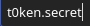

# Salt Bot Version 2

A discord bot used by me and my friends feel free to fork and use on your server! This is a bot mean't to do everything!* It includes some basic bot functions, administration tools, games, and much more!

*By everything I mean what ever I put into it

### **Beta Warning**
All beta versions of Salt Bot have devmode enabled by default to hange this replace the line 
```py 
if v.startswith("Beta"): devmode = True
else: devmode = False
```
with
```py
devmode = False
```

## Basic Setup

### Token Setup

For your bot to work you must first create a Discord bot to do this you must go to [The Discord Developer Portal](https://discord.com/developers/applications) and create a bot. Once you sign in you have to create an application this is going to be your bot. 


Once you're there you're going to name your project whatever you want! (Note: This will not be the display name of your bot to other users. That step will come later.)


Here is where we make our bot! Ignore all of the other sections the only part we care about is the Build-A-Bot in the Bot Section

 


Once you do that you'll generate a new user! This is what is shown to the people using your bot! Here you can change the public name and image. What we're interested in here is the token. While you're here enable "Requires OAuth2 Code Grant" and if you want others to use your bot you may enable "Public Bot" so others may also add it to their server

 
 (BTW this token is invalid don't even try to use it)

Next we need the bot to recognize this token. To do this we save it to a file called `t0ken.secret` in the root directory of the Salt Bot install. You can use Notepad or any other plaintext editing tool to save this file. 

 


### Server Setup

To set up your bot to be visible in a server you need to go back to the Bot section in the Discord Developer Portal and enable all privileged gateway intents.


Next we're going to create a URL. This is what will enable our bot to join a server. In order for our bot to join a server you are going need  
admin privileges in that server or else this bot will not be able to join. Then check the "bot" box and in the next section only enable the "Administrator" box.


You'll then get a link generated at the bottom of the page. Simply copy and paste it into your favorite browser and log in to Discord if needed. Then select the server which you're going to put the bot into.


Voila! Your bot is now in a server follow the next section to bring your bot online!


Another ting you are going to want to do is create a file in ./Frontend/txt called credit.json with just ```{}``` in it.

## Installation

This is a pure python project which means there's no way to "install" it but you can run it and here's how

```bash
  git clone https://github.com/Gabe-N-Olivas/Salt-Bot-v2
  cd Salt-Bot-V2
  python3 bot.py
```
If you want to run this in the background do the following (This is assuming this script is job #1 to be sure run `jobs` to see which job this script this is):

Do the key combo 'Ctrl+Z'
Then enter the following commands
```bash
  bg
  disown %1
```


After that you may also want to customize it a little. Some ways you can do this is by replacing images in the ```./Frontend/RandMeme``` folder with your own fun images and fill in ./Frontend/txt/pasta with your own funny messages (so long as they're under 4000 characters and the file's name all lowercase and a .txt file).

Another thing you may want to do is change the default dev password (root) using the the makehash.py file.

## Roadmap

Right now I'm the only one who's running this project and between school, and work I may not have a ton of time to work on this project. That being said here's what I plan for the future of this bot in order of priority:

1. Implement Embeds. This will make the output of the bot look a lot cleaner and more organized
2. Add a .conf file for global customization. This will allow for greater customization for bot hosters as well as reducing the risk of a user ruining smooth operation of the bot.
3. Add a console for direct access to the bot. I admit this will most likely cause instability but I think it would be a good option for bot hosters.
4. Switch the bot from using prefixes to discords new "/" commands.


## Used By

This project is used by the following servers:

- The Salt Locker
- Mr.BlueSky's House
- Maybe Your Server!


## License

This project is licensed under the GPL V2. I recommend you read the full license at the end of this file but for those who wont here's the TL;DR:

Also this is not legal advice I'm just a novice programmer not a fully trained lawyer!

- What you *CAN* do: This license allows **Modification**, **Distribution**, **Commercial Usage**, and **Placement of Warranty** 
- What you *CANNOT*: This license does not allow **Sublicensing**, and **Holding The Developer Liable**
- what I *MUST* do: This license requires me to **Include Original Code**, **Disclose Source Code**, **Include License**, and **State Changes To Source Code**

  [Read Full License Here](https://www.gnu.org/licenses/old-licenses/gpl-2.0.html)